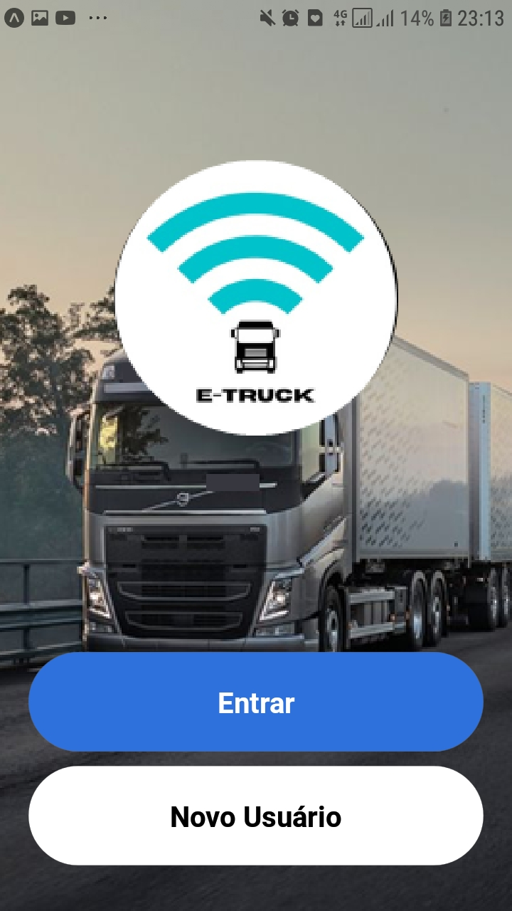
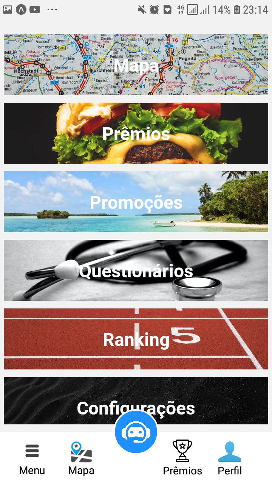
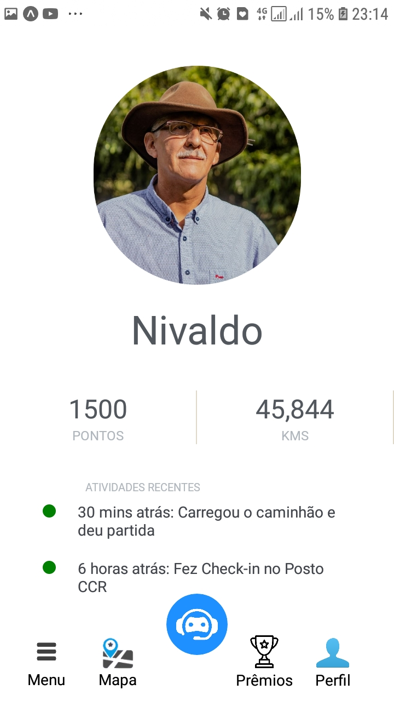
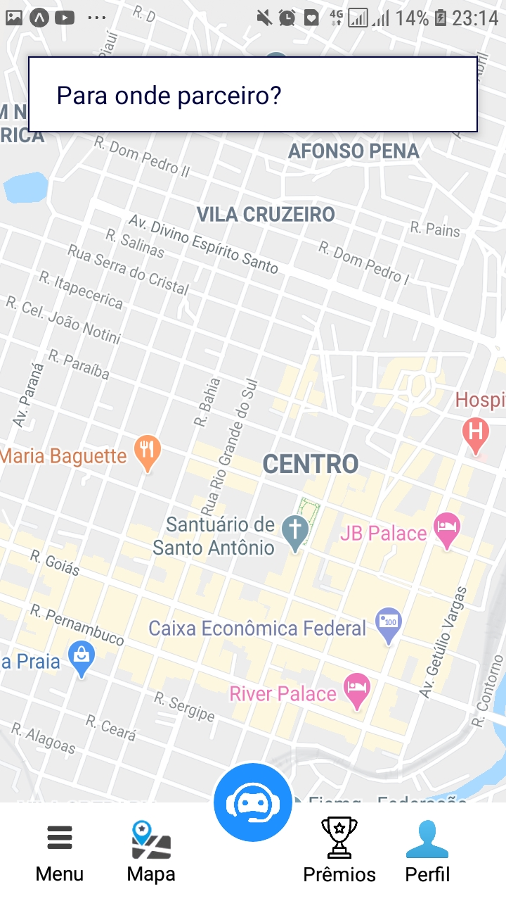
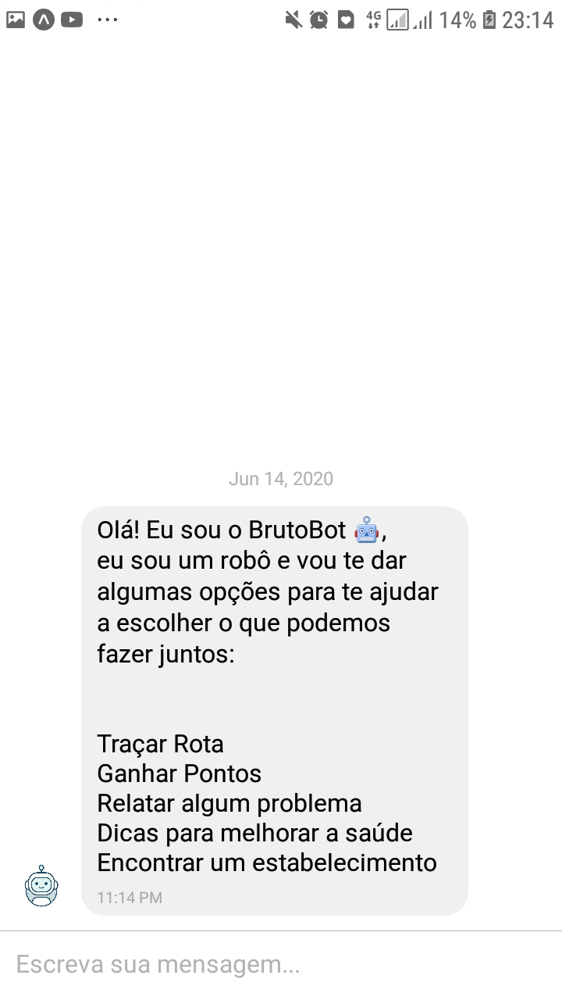
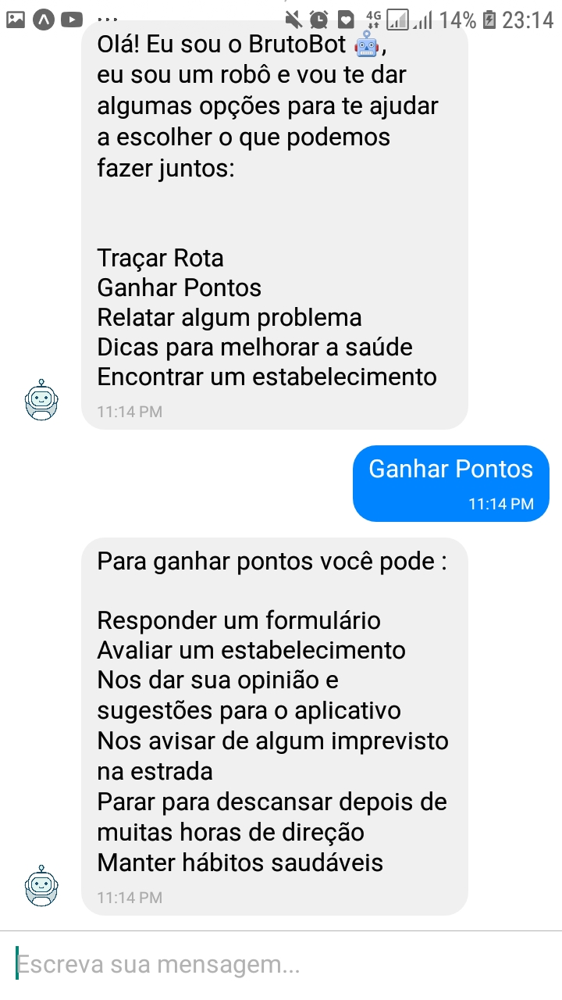
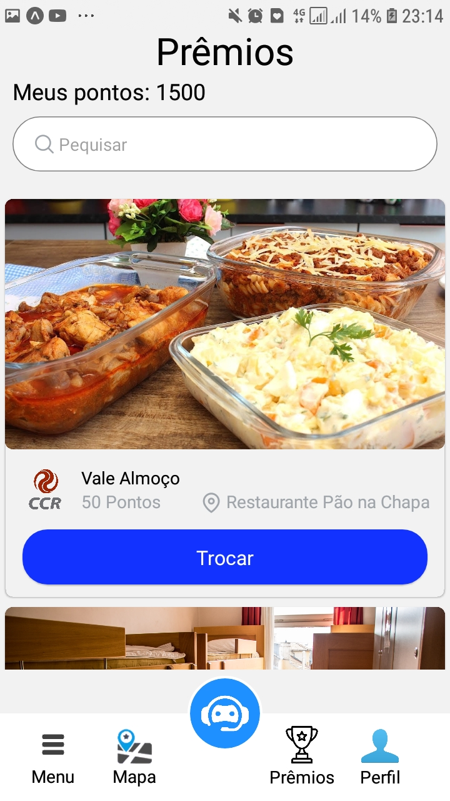
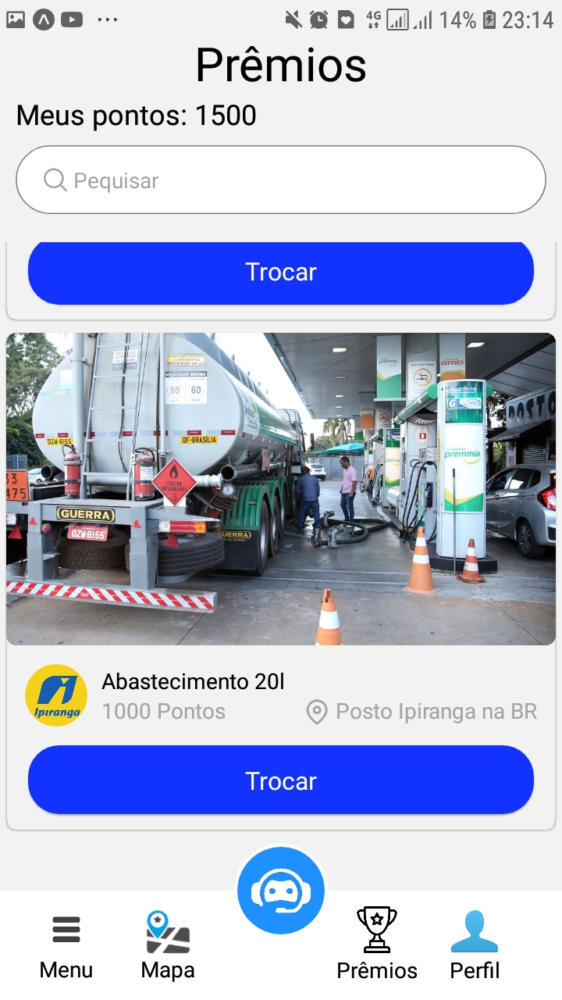

# E-Truck

<h1>What the project is about</h1>

Our project has as main objective to assist the driver in his pains. The App is the union of resources that are necessary for the improvement of his well-being and health. We seek to innovate through artificial intelligence and the compilation of problems, offering the best service to the user.

<div style="display: flex">
    
    
    
</div>

<h2>Features</h2>

<h3>Map with Routes</h3>



<h3>Bot with Artificial Intelligence with Integrated Solutions</h3>

<div style="display: flex">
    
    
</div>

<h3>Gamification for Truck Driver</h3>

<div style="display: flex">
    
    
</div>


<h2>Required</h2>
To use the app you are going to need the Node.js with NPM installed. You can download the latest at:

https://nodejs.org/pt-br/download/

Then you need to install the expo. You can download the latest at:

https://expo.io/tools

<h2>Installation and How to Use</h2>
First clone the project.

```
git clone https://github.com/BraianMendes/BeeLeads-Test-Braian.git
```

Then you need to install the dependencies.
```
expo install
```

And now the last step is execute both applications. Inside the frontend directory and the backend directory, execute at same time in different terminals npm start.

```
expo start
```
The command will start the app in a Metro Bundler.
You can access now with the Android Emulator or opening the Expo app from the PlayStore.


You can access our database at:

```
e-truck-database.cljnpojjwj1y.sa-east-1.rds.amazonaws.com
Port 3306
```

Obs: Our Back-End developer was sick throughout the hackaton and we had to work only with the front-end developer.

<strong>Thank you very much for reading so far. We're open for everything, and I really hope to see you sirs in next time in the selection. Best Regards, E-Truck team.</strong>
